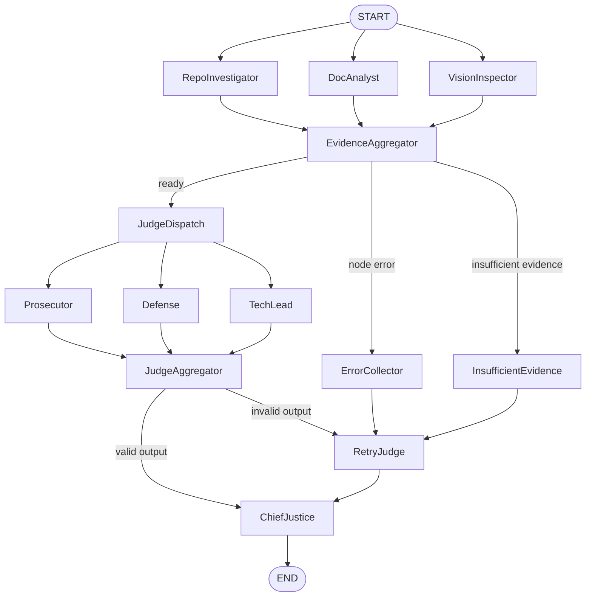

# Automaton Auditor - Digital Courtroom (Final Delivery)

LangGraph-based autonomous governance system for auditing a target GitHub repository plus an accompanying PDF report.

## What This Repository Implements

- Typed governance state and contracts in `src/state.py`
- Forensic repo analysis tools in `src/tools/repo_tools.py`
- PDF ingestion, claim extraction, and image extraction in `src/tools/doc_tools.py`
- Detective nodes in `src/nodes/detectives.py`
- Judicial layer in `src/nodes/judges.py` using `.with_structured_output(JudicialOpinion)`
- Deterministic synthesis in `src/nodes/justice.py`
- Complete orchestrated graph in `src/graph.py`
- CLI runner in `src/cli.py`

## Architecture



## Setup

1. Install dependencies with uv:

```bash
uv sync
```

2. Configure environment:

```bash
cp .env.example .env
```

3. Set at least:
- `OPENAI_API_KEY` (optional for deterministic fallback mode, recommended for judge LLM execution)
- `LANGCHAIN_API_KEY` and `LANGCHAIN_TRACING_V2=true` for LangSmith tracing

## Run

Run a full audit and produce output artifacts:

```bash
uv run automation-auditor audit-snapshot \
  --repo-url https://github.com/owner/repo.git \
  --pdf-path reports/final_report.pdf \
  --output-dir audit/generated
```

Outputs:
- Timestamped JSON run result
- Snapshot markdown
- Rendered audit report markdown (serialization of `AuditReport`)

## Required Delivery Artifacts

- Final PDF report: `reports/final_report.pdf`
- Generated markdown reports:
  - `audit/report_onself_generated/`
  - `audit/report_onpeer_generated/`
  - `audit/report_bypeer_received/`
- Rubric constitution: `rubric.json`
- Dependency lock: `uv.lock`

## LangSmith Trace

- Add your trace link in `.env` via `LANGSMITH_TRACE_URL`
- Share the link in final submission notes once you run a traced end-to-end audit.

