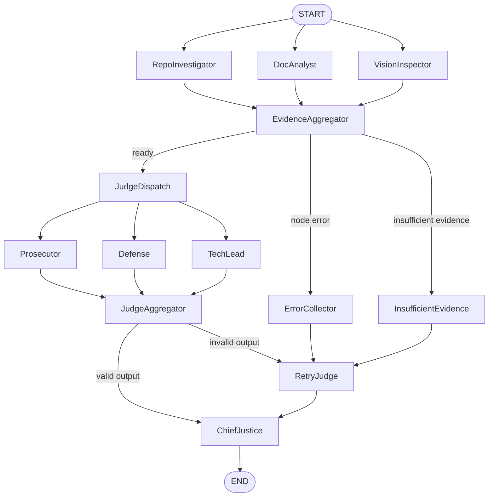

# Audit Snapshot

- Generated UTC: `2026-02-26T17:21:33.306431+00:00`
- Repo URL: `https://github.com/eyorata/automation_auditor.git`
- PDF Path: `reports/Interim Submission Report.pdf`
- Raw JSON: `audit/generated/audit_snapshot_20260226T172130Z.json`

## Architecture Diagram

## Runtime Summary

- Total Evidence Items: **9**
- Average Confidence: **0.906**
- Flags: `{'vision_inspector_failed': True, 'insufficient_evidence': False, 'has_node_errors': True}`
- Node Errors: `1`

## Evidence Counts By Bucket

- `error_collection`: 1
- `evidence_aggregation`: 1
- `git_forensic_analysis`: 1
- `graph_orchestration`: 1
- `pdf_report_analysis`: 2
- `repo_file_inventory`: 1
- `state_management_rigor`: 1
- `vision_inspector_error`: 1
